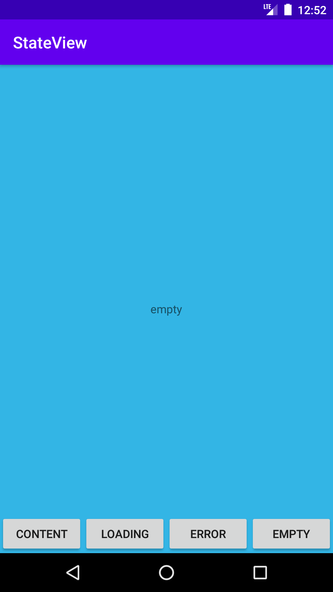
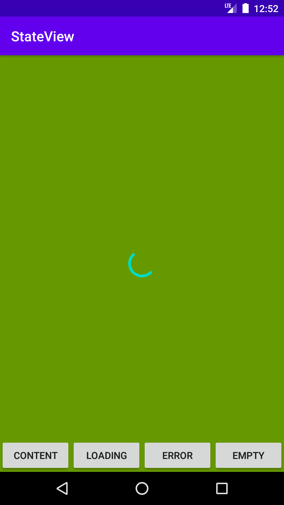
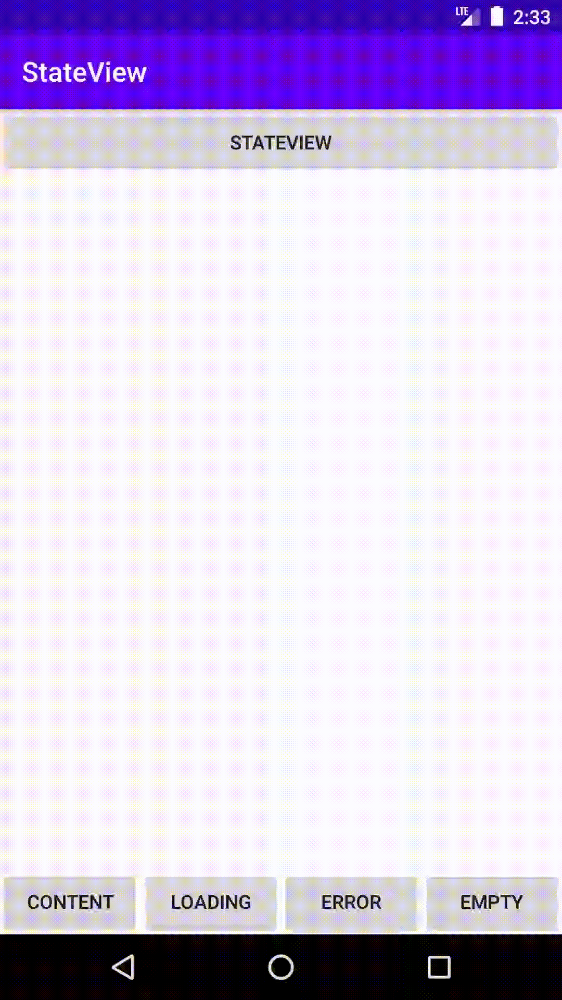

# StateView
[](https://jitpack.io/#MrAdkhambek/StateView)

```gradle
	allprojects {
		repositories {
			...
			maven { url 'https://jitpack.io' }
		}
	}
```
```gradle
	dependencies {
	        implementation 'com.github.MrAdkhambek:StateView:0.1.0-alpha02'
	}
```

```xml
    <!--    your custom layout file @layout/layout_content_main -->
    <r2.adam.sv.StateView
            android:id="@+id/stateView"
            android:layout_width="match_parent"
            android:layout_height="match_parent"
            app:contentResource="@layout/layout_content_main" />
```

```xml

    <!--  another custom layouts -->
    <resources>
        <declare-styleable name="StateView">
            <attr name="emptyResource" format="reference" />
            <attr name="errorResource" format="reference" />
            <attr name="contentResource" format="reference" />
            <attr name="loadingResource" format="reference" />
        </declare-styleable>
    </resources>
```

```kotlin
    
    stateView.setState(State.CONTENT, ::setContentDefaultListeners)


    private fun setContentDefaultListeners(content: View) {
        content.findViewById<View>(R.id.okBtn).setOnClickListener {
            Toast.makeText(it.context, "Click", Toast.LENGTH_SHORT).show()
        }
    }
```





